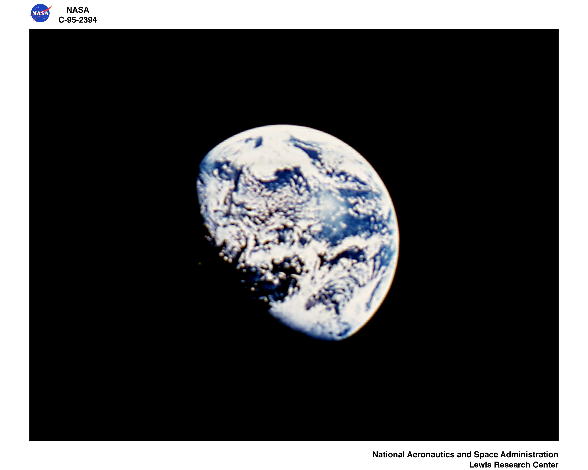

## Actividad 1 - Edición de archivos Markdown  
Keywords: `Markdown` `Title` `Table` `Hyperlink` `Image`

 
Planet Earth / Nasa Aeronautics and Space Administration / Lewis Research Center / https://archive.org/details/C-1995-2394

| Actividad | Alcance                          |
|-----------|----------------------------------|
| 1         | Agregar título                   |
| 2         | Agregar palabras clave           |
| 3         | Agregar imágenes hipervinculadas |
| 4         | Agregar tablas                   |

